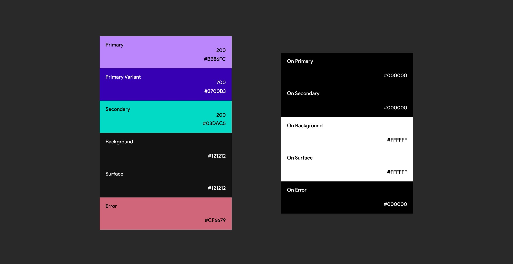

# Light Dark Mode

> Build Light and Dark Themes for a GItHub JavaScript.
> Loosely based on [Material Design Guidelines](https://material.io/design/guidelines-overview) by Google.

## 🎯 Goals for this project

- Design a light and dark theme
- Build a toggle switch with JavaScript
- Check user preference for Dark mode

## 📖 User Stories

- [x] HTML & CSS setup
- [x] Add project content
- [x] Toggle theme with JavaScript
- [ ] LocalStorage to save user data
- [ ] Code Review

## 🎨 Color Palette

> Dark Theme Baseline Palette

The colors on the right side are called ‘On’ colors. They are applied to text, icons, and strokes which are placed “on” top of surfaces that use a primary, secondary, surface, background, or error color.

## 🌐 Resources

- [Dark Mode Colors How-to Guide](https://blog.prototypr.io/how-to-design-a-dark-theme-for-your-android-app-3daeb264637)
- [FontAwesome Icons](https://fontawesome.com/icons?d=gallery&q=close&m=free)
- [Google Fonts](https://fonts.google.com/)
- [Hero Patterns](https://www.heropatterns.com/)
- [Mozilla CSS Variables](https://developer.mozilla.org/en-US/docs/Web/CSS/Using_CSS_custom_properties) - using CSS custom properties
- [Mozilla- Document Element](https://developer.mozilla.org/en-US/docs/Web/API/Document/documentElement)
- [Undraw Illustrations](https://undraw.co/illustrations)
- [W3Schools - Change Event](https://www.w3schools.com/jsref/event_onchange.asp)
- [W3Schools - Switch](https://www.w3schools.com/howto/howto_css_switch.asp)
